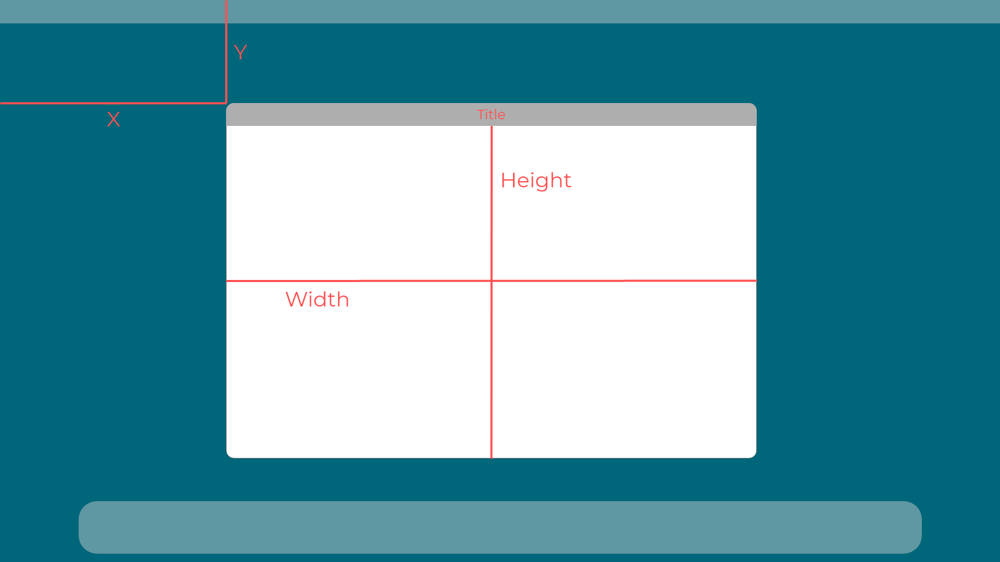
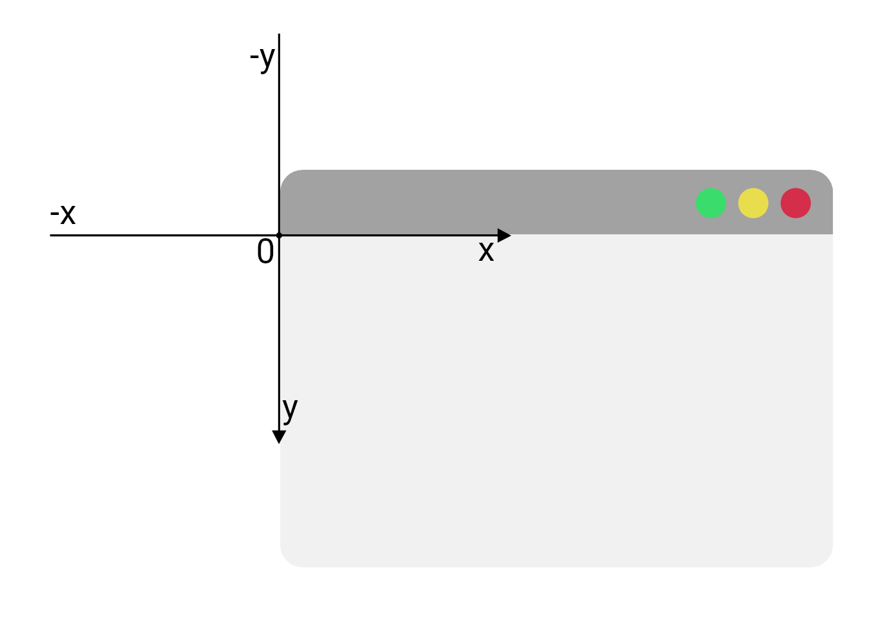
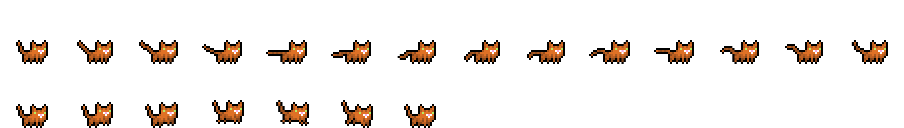
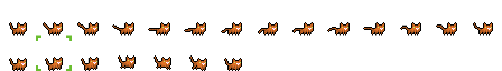
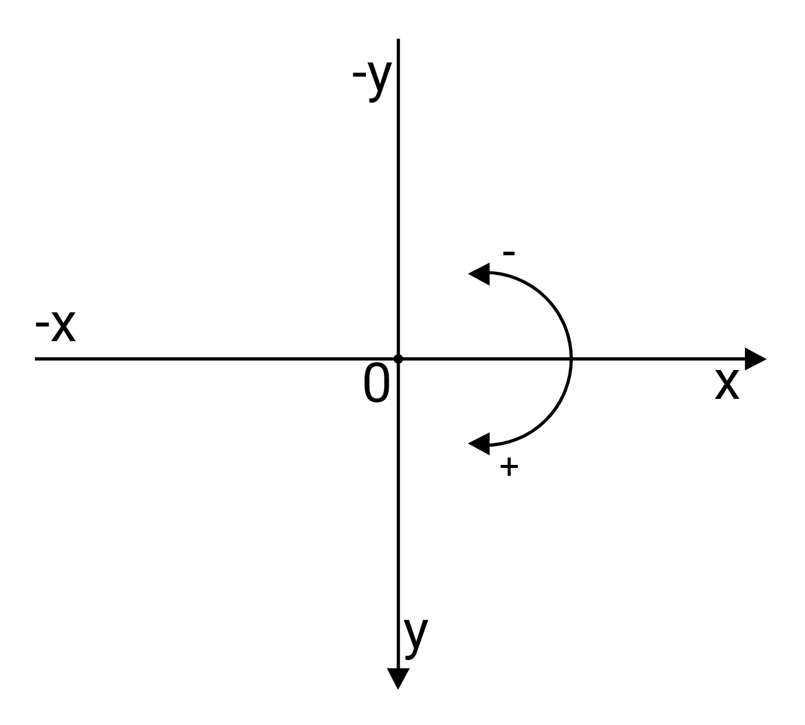

# Documentation
## Table of contents
- [GameEngine/](#gameengine)
  - [Activatable](#activatable)
  - [Border](#border)
  - [Collision](#collision)
  - [ControlObserver](#controlobserver)
  - [Engine](#engine)
  - [Input](#input)
  - [Observer](#observer)
  - [Utility](#utility)
  - [Vector2D](#vector2d)
  - [GameEngine/ECS/](#gameengineecs)
    - [Entity](#entity)
    - [Manager](#manager)
    - [GameEngine/ECS/Components/](#gameengineecscomponents)
      - [Animation](#animation)
      - [Collider](#collider)
      - [Sprite](#sprite)
      - [Text](#text)
      - [Transform](#transform)
  
-------

## GameEngine/
> This is the directory of the engine that we made to run the game.

Look at the [engine](#engine) class to know how it works.

-------
### Activatable
This class makes possible to add a toggleable state to any object. 

This is very useful in case of objects that we want to be stored in memory but that we don't want to use in a certain moment. The deactivated object will remain in a sort of **"ghost state"** until the object's **toggle** function is called.

The **toggle** function can be called to switch the state of an activatable object. You can also pass a value to the function to switch directly to the state that you want, independently of the state that the object was in:
```C++
//Assuming the active variable of actObj is set to false

actObj.toggle(); //this switches it to true
actObj.toggle(true); //this switches it to true once again
actObj.toggle(); //this switches it to false
```

To read the state of the object you can use the isActive function, that will return a bool&.

-------
### Border
Border is a class that we use to represent the border of a polygon.

It's composed of 2 **[vector2d](#vector2d)**: prevVertex and nextVertex.

It also has a boolean attribute to define the internal side of the border. To determine which side is the internal one: you have to "look" at nextVertex from the point of view of prevVertex: if the inner side is on the right, the attribute has to be set to true, otherwise it has to be set to false.

The checkSide method receives a **[vector2d](#vector2d)** that represents a point. Then it returns true if the point is inside the polygon, otherwise it returns false.

The checkBordersIntersection method controls if two borders intersect. It first calculates the intersection point of the lines passing by the vertices of the two borders, then it checks if the intersection is on the borders or on their extensions. It also checks if the nextVertex of a border is in the inner side of the other and viceversa.

-------
### Collision
It is a set of functions used to calculate the collisionVector between every colliding entity and pass it to the entity's resolveEntityCollision method to resolve the collisions.

Because an entity can be composed by one or more colliders, the algorithm calculates the resulting vector from all the collider's collisions.

> Warning: due to finite algebra approximation, the polygon algorithm is not working properly. This version of the engine only supports rectangular colliders.

> Note: This algorithm has been created and completely implemented only by us to fit the particular needs of our code. We do not suggest to rely completely on our algorithm because of it's untested reliability.

-------
### ControlObserver
// TODO

-------
### Engine
The **[engine](#engine)** is responsible of a lot of things: 
- creating the window
- managing the scale of all the objects (in case the resolution changes)
- creating the camera
- creating the renderer
- managing the draw requests from other classes
- adding and removing managers
- arrange managers by given priority
- calling the update function of all the **[managers](#manager)** (following the order given by priority)
- keep the things running until the isRunning variable switches to false.

Using the getInstance function you can initialize the window that is going to display all the things that the engine is going to render.
To instantiate a window, the things that you will have to pass are: a title (the name that the OS will display for that window), an x and y value (to determine where it's going to be placed on the screen), a width and height (the actual size of the window) a fullscreen parameter (it's boolean and it's used to determine if the window has to be fullscreen when the game starts).



The engine is also going to be responsible of managing the update system.
The way updates are managed is:
- using the update function in the engine we update every single manager that is active (take a look at **[activatable](#activatable)** for an explanation);
- inside each **[manager](#manager)** we have another update function that updates every single active **[entity](#entity)** inside that **[manager](#manager)**;
- inside each **[entity](#entity)** there's another update function that updates all the active components of that entity;
- inside each **[components](#gameengineecscomponents)** there's an update function, the scope of that function will differ depending on the tipe of the **[components](#gameengineecscomponents)**.


-------
### Input
// TODO

-------
### Observer
This is an abstract class that follows the observer design pattern, revisited to take SDL events as update parameter.

-------
### Utility
This is a set of general purpose functions that can be useful to multiple classes.
It features:
- A bubble_sort function that executes a bubble sort algorithm on a given collection using the passed iterator (begin and end). To order the objects inside the collection we also need to pass an object with a compare method.
- A checkLinesIntersection function that is able to check if two lines are intersecting. To do so we have to pass two pairs of vector2ds; the first pair of vectors have to be the x and y coordinates of the vertices of the first line, the same thing applies to the second pair with the coordinates of the second line.

-------
### Vector2D
This class is used to manage any coordinate inside the engine. It does so using int values, as SDL2 uses integers to know where a renderer has to draw something.
> Example: if a sprite is drawn at coordinates 0,0 (by the renderer) and the camera is centered the sprite will be drawn in the upper left corner of the window. If the sprite moves to 20,10 then the renderer will draw it 10 pixels from the top of the window and 20 pixels from the left.

The coordinates are managed like so:



> Note: In some cases we used a static function called "toCartesian" wich returns a Vector2D generated using polar coordinates

-------
## GameEngine/ECS
> Note: ECS stands for entity component system.

To manage the entities in our game we needed a few things: some way to manage them on different layers (to render one entity on top of another for example) and to figure out a way to attach some "**[components](#gameengineecscomponents)**" to them.
To do so we first created the **[manager class](#manager)** and the **[entity class](#entity)**. Then we decided to put all of the components in a separated folder, called **[Components](#gameengineecscomponents)**.

### Entity
An **entity** can be anything in a game: if an object has a **[sprite](#sprite)**, a **[collider](#collider)** or there's some **[text](#text)** then that thing is an **entity** with it's **[components](#components)**.

> Example: things that an entity could represent could be: characters, walls, weapons, bullets, map tiles, walls doors, chests and many more.

The foundamental things to define an Entity are:
- The texture path, which is a string containing the path to the file that contains it's texture (or it's spritesheet if that entity needs an animation);
- The solid variable, which is a boolean that defines if the resolve collision algorithm of that entity has to be executed;
- The active variable, to define if the entity is currently active (there are some cases where you may need an entity to be deactivated or be "hidden" from the scene to appear in a particular moment).

-------
### Manager
> This is the class to rule them all...

A manager is responsible of managing the group of entities that are added to it's map.

> Note: An entity is meant to be added to only one manager. You could add it to multiple ones, but the update code of that entity will be executed 2 times and if that entity is solid the collision control will also be executed 2 times,as well as, in some cases, the resolve collision algorithm.

You can also assign a  priority to a manager to define if it has to be rendered on top of another.

> Example: if you have a character, it needs to be rendered on top of the floor, to do so it's necessary to assign a priority to both the character manager and the map manager to give the rendering order to the **[engine](#engine)**.

To have full control over collisions a manager has 2 more fields: localCollisionsActive and globalCollisionsActive.

These two fields respectively define if the collisions (between entities) inside the same manager are active and if the collisions (between entities) inside two different managers are active. If any of those type of collisions are active then the engine is going to call the control collisions and resolve collisions methods of the entities that are part of the respective group (the one with local/global collisions active) and that are solid.

> Note: If you have two managers and one has globalCollisionsActive set to true and the other one has not, then all collisions appening between the entities of the two colliders are ignored and the entities that are part of the manager with the highest priority are rendered on top of the entities of the other manager.

-------
## GameEngine/ECS/Components
So, what is a component? It is a class. An **[entity](#entity)** has an object (or a map containing objects) from that class. Since they derived from activatable they will be active only on entities that require them.

> Example: Let's imagine that we have two **[entities](#entity)** inside our game: a **character** and an **invisible barrier**. When creating those **[entities](#entity)** the programmer is going to activate the **[sprite component](#sprite)** of the **character** to make it visible (and maybe adding an animation for the movement) and activate the **[collider component](#collider)** of both the **character** and **invisible barrier**. 
This way we can make the invisible barrier code a lot lighter to execute, since the engine won't have to execute the part of code that is necessary to manage the sprite and/or the animation of that entity.

-------
### Animation
This class is used by the **[sprite](#sprite)** class to manage animations.

It is able to calculate the index of the sprite in a spritesheet composed of a given number of frames at a given speed.

-------
### Collider
Collider is essentially a vector of **[borders](#border)**.

-------
### Sprite
This is the essential component to make an entity visible on screen.
The sprite component can be used to assign a static texture or an animation to an entity.

Using a static texture is easier, you only need a texture path (it's a string that has to contain the path to the texture), the srcRect (that we will se in a moment) and to set the active parameter to true.

So what's a srcRect? It's a rectangle that SDL2 needs to know which part of an image it has to display.

> Example: if we are working with a static image and it's 512x512 pixels then we will need to set the h and w fields of the rectangle to 512, like so:
```C++
srcRect.h = srcRect.w = 512;
```
> If we want to only pick aportion of that image, let's say the bottom right corner, then we are going to have h and w set to half of the original size and x and y to the coordinates of the point we want to pick, in this case 256 and 256
```C++
srcRect.h = srcRect.w = 256;
srcRect.x = srcRect.y = 256;
```

If you need an animation, then we got you covered: sprite has two methods to manage animations: an add animation and a remove animation.

Each animation will have a name, an index (starts from 0), a number of frames and a speed. Using this system you will be capable to store all the animations inside a same tile set and filter them using the index.

To give a better explanation of all the fields needed: the name has to be an id, something unique for the set of animations you are using and something you can remember, to be able to easily switch from one animation to another (using the set current animation method and passing the name of the animation you want to display); the index is the height for the srcRect to know where the animation starts (see the image above); frames is the number of frames that compose the animation and the speed represents for how many milliseconds a frame has to be displayed (you can't set a speed for each frame but you can have different speeds for each animation).

> Example: in the following spritesheet we have two animations on two different lines.


> To add those animations we are going to do this:
```C++
SDL_Rect srcRect; //create a rect to define the dimension of each frame
srcRect.w = srcRect.h = 32; //in this case both the width and height are set to 32 pixels
entity.setRect(rect); //set the srcRect variable of the sprite using the one we just created

entity.getSprite().addAnimation("cat static", 0, 14, 100) //for the first animation

entity.getSprite().addAnimation("cat right", 1, 14, 100) //for the second animation
```

> Note: the index is the "row" of the animation: in the following image the one in the green square is at index 1 (cause we start from 0) and is rendered at the second iteration of the animation (because is the second frame of the animation).

Using the setCurrentAnimation() method we can switch the animation that is being rendered, the only thing we need is to pass the animation name (of the animation we want to switch to) to the function and the engine will automatically switch the index and start displaying the animation from it's first frame.

-------
### Text
Writing text on screen is very easy, you could do it using sprites if you prefer, but the text component allows for a better management of it.

To create text you need to define:
  - a message: the string you want to display;
  - a size: the size you wnat for the text (in pixels);
  - a font path: to set a custom font to the text (it's a path to the .ttf file);
  - a color: the color you want the text to be displayed with (using the RGBA standard);
  - an offset: this is the offset between the text and the entity.

  > Note: the values assigned to the offset are added to the values of the position of the entity to generate the final destination (the position where the text is going to be rendered).

  > Example: if the entity's position is (10,15) and the offset x and y are set to (2, 3), the text is going to be displayed 2 pixels to the right and 3 from the top (of the entity's position).

  > Note: the position of the text on screen will be relevant to the one of the entity. if you want to print a text in a certain position you will have to change the entity's transform to be in the position you want.

  > Example: If a character (entity with a sprite) has a name, then you can print a name on top of it's sprite using the text component. Doing so allows the text to move automatically with the character.

-------
### Transform
The transform component is essential for every entity. It defines it's position, if it's moving, it's direction and it's speed.

The position is stored in a Vector2D but when constructing the object you can simply use int values to define the x and y positions.

The speed is an integer value and defines the speed of the object when it's moving.

The moving variable is boolean and is needed to know if the object has to be moved. if it's set to false the entity will remain still, if it's set to true then the entity will be moved by it's speed in it's direction.

The direction is a little bit tricky: it's measured in radians, the positive direction is clockwise and the 0 is on the positive x axis (right side).



-------

